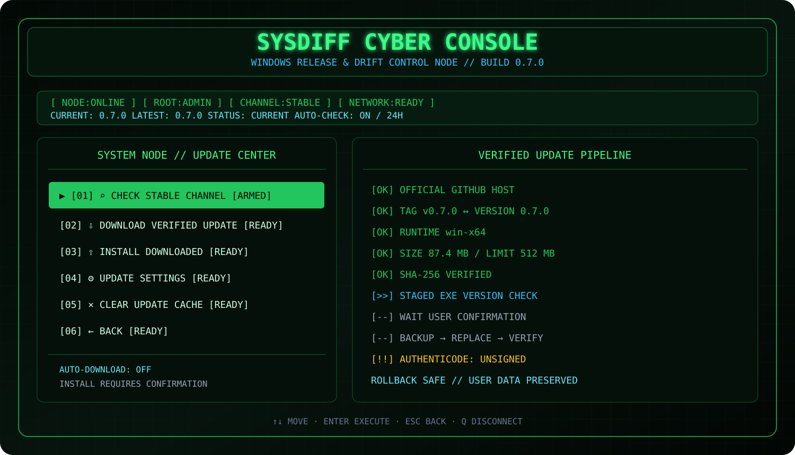

<div align="center">


# SysDiff

**Полноценная cyber-terminal утилита для снимков, сравнения, расследования дрейфа и безопасного обновления Windows-инструмента.**

[](https://github.com/Onmaynec/SysDiff/actions/workflows/build.yml)
[](https://github.com/Onmaynec/SysDiff/actions/workflows/test.yml)
[](https://github.com/Onmaynec/SysDiff/releases)
[](LICENSE)
[](#-системные-требования)
[](CHANGELOG.md)

</div>

> [!IMPORTANT]
> **SysDiff не является антивирусом.** Он фиксирует, сравнивает и объясняет системные изменения, но не объявляет объект безопасным или вредоносным.



## 🚀 SysDiff 0.7.0 — Release Channel

Версия 0.7.0 переводит проект на полноценные релизы:

- автоматический тег `vX.Y.Z` на squash merge-коммите;
- GitHub Release с portable ZIP;
- `.sha256` и `release-manifest.json`;
- GitHub artifact provenance attestations;
- встроенная проверка stable channel;
- безопасная загрузка, staging, backup и rollback;
- Update Center внутри Cyber Console.

### Установка из GitHub Release

Откройте [Releases](https://github.com/Onmaynec/SysDiff/releases), скачайте:

```text
SysDiff-0.7.0-win-x64.zip
SysDiff-0.7.0-win-x64.zip.sha256
release-manifest.json
```

Распакуйте ZIP и запустите:

```powershell
.\sysdiff.exe
```

Portable-пакет не требует установленного .NET Runtime.

## 🔄 Автообновления

```powershell
sysdiff update check
sysdiff update status
sysdiff update download
sysdiff update install --yes --restart
```

Настройки:

```powershell
sysdiff update settings
sysdiff update settings --auto-check true --interval-hours 24
sysdiff update settings --auto-download true
sysdiff update settings --auto-check false
```

По умолчанию:

```text
stable channel     ON
auto-check         ON, не чаще раза в 24 часа
auto-download      OFF
auto-install       OFF и не может быть включён
install confirm    обязательно
```

Auto-check выполняется только в обычном интерактивном режиме, ограничен коротким timeout и не блокирует запуск при недоступной сети.

### Проверяемая цепочка обновления

```text
official latest release
          ↓
release-manifest.json
          ↓
product / stable / SemVer / runtime / tag / URL validation
          ↓
size + SHA-256 verification
          ↓
safe ZIP extraction
          ↓
staged sysdiff.exe --version
          ↓
explicit install confirmation
          ↓
wait current PID → backup → replace → verify
          ├─ OK    → remove backup + optional restart
          └─ FAIL  → rollback previous sysdiff.exe
```

Updater принимает asset только с официального HTTPS-пути:

```text
https://github.com/Onmaynec/SysDiff/releases/download/vX.Y.Z/...
```

Версия 0.7.0 пока не имеет Authenticode-подписи. Manifest честно содержит `unsigned: true`; GitHub provenance и SHA-256 подтверждают происхождение pipeline и целостность assets, но не выдаются за code-signing сертификат.

Подробнее: [docs/UPDATES.md](docs/UPDATES.md).

## 🖥️ Cyber Console

Запуск панели:

```powershell
sysdiff
```

Из исходников:

```powershell
dotnet run --project .\src\SysDiff.Cli
```

Cyber Control Node содержит девять модулей:

```text
[01] Snapshot Node
[02] Diff Lab
[03] Drift Operations
[04] Investigation Timeline
[05] Case Vault
[06] Watch Operations
[07] Live Signal
[08] Report Vault
[09] System Node
       └─ Update Center
```

### Command Deck

| Клавиша | Действие |
|---|---|
| `1`…`9` | открыть модуль по номеру |
| `P`, `B`, `A` | Snapshot Node |
| `C` | Diff Lab |
| `G` | Drift Operations |
| `T` | Investigation Timeline |
| `K` | Case Vault |
| `W` | Watch Operations |
| `L` | Live Signal |
| `D` | System Node |
| `↑` / `↓` | перемещение |
| `Enter` | выполнить действие |
| `Esc` | назад |
| `F5` | обновить Control Node |
| `Q` | завершить сессию |

## 🧷 Baseline Vault

Baseline — сохранённый снимок, который пользователь считает доверенным состоянием системы.

```powershell
sysdiff baseline set trusted-clean --note "После чистой установки"
sysdiff baseline show
sysdiff baseline clear
```

Снятие baseline не удаляет snapshot. Failed, cancelled и corrupted snapshots закрепить нельзя; partial snapshot требует явного предупреждения.

## 📡 Drift Scan

```text
trusted baseline
       ↓
current snapshot
       ↓
comparison + noise filter
       ↓
explainable risk score
       ↓
HTML + JSON + timeline + active case
```

```powershell
sysdiff drift scan
sysdiff drift scan --profile minimal --noise Strict
sysdiff drift scan --profile standard --noise Balanced
```

Результат содержит индекс `0–100`, уровень Stable/Notice/Elevated/High/Critical, факторы оценки, предупреждения partial providers и пути отчётов.

> [!NOTE]
> Drift Risk Score — детерминированная эвристика важности изменений, а не вероятность заражения.

## 🕒 Investigation Timeline

```powershell
sysdiff timeline list
sysdiff timeline list --limit 100
sysdiff timeline list --kind DriftScan
```

Timeline объединяет snapshots, comparisons, Drift Scans, reports, cases и заметки baseline. Данные версий 0.1–0.5 реконструируются без перезаписи legacy tables.

## 🗂️ Case Vault

```powershell
sysdiff case create "Installer audit" --description "Проверка Setup.exe" --tags installer,test
sysdiff case list
sysdiff case show "Installer audit"
sysdiff case use "Installer audit"
sysdiff case close "Installer audit"
sysdiff case use none
```

Drift Scan автоматически связывает snapshot, comparison и HTML report с активным кейсом. Закрытие кейса не удаляет материалы.

## ⚡ Анимации действий

Cyber Console сохраняет:

- boot sequence;
- Action Console;
- Provider Stream;
- progress/scanner bars;
- elapsed time;
- neon green/cyan/amber/red theme;
- маркеры `[OK]`, `[>>]`, `[--]`, `[!!]`, `[XX]`, `[//]`.

```powershell
$env:SYSDIFF_NO_ANIMATIONS = "1"
$env:NO_COLOR = "1"
sysdiff
```

В CI и при redirected output интерактивное движение отключается автоматически.

## ✨ Основные возможности

- снимки файлов, реестра, служб, задач и автозагрузки;
- переменные окружения и PATH;
- Windows Firewall;
- установленные приложения;
- системные драйверы и SHA-256;
- сертификаты Windows без чтения приватных ключей;
- адаптеры, DNS, шлюзы, proxy и маршруты;
- Process и Network Live Monitor;
- ожидание дерева дочерних процессов;
- `Moved` и `Renamed` detection;
- cross-machine compare;
- `.sdshot` с manifest и checksums;
- investigation bundle;
- пользовательские JSON-профили;
- Provider SDK и явная загрузка DLL;
- маскирование `%USERPROFILE%`;
- Console, JSON, Markdown и автономные HTML-отчёты;
- SQLite и portable mode;
- stable release channel и безопасный self-update.

## 🔍 Классический CLI

```powershell
sysdiff doctor
sysdiff snapshot create before --profile standard
sysdiff snapshot create after --profile standard
sysdiff compare before after --format html --output .\report.html
sysdiff watch .\Setup.exe --wait-for-children --timeout 900
sysdiff live process --duration 60
sysdiff snapshot export before --output .\before.sdshot
sysdiff update status --json
```

При перенаправленном `stdin` или `stdout` TUI не запускается и не загрязняет машинный вывод управляющими последовательностями.

## 🛠️ Сборка

### Системные требования

- Windows 10 x64 или Windows 11 x64;
- CMD, Windows PowerShell, PowerShell 7 или Windows Terminal;
- .NET 8 SDK для сборки;
- права администратора рекомендуются для полного снимка.

```powershell
git clone https://github.com/Onmaynec/SysDiff.git
cd SysDiff

dotnet restore SysDiff.sln
dotnet build SysDiff.sln --configuration Release
dotnet test SysDiff.sln --configuration Release
```

Portable release package:

```powershell
.\scripts\package.ps1 -Version 0.7.0
```

Результат:

```text
artifacts\SysDiff-0.7.0-win-x64.zip
artifacts\SysDiff-0.7.0-win-x64.zip.sha256
artifacts\release-manifest.json
```

## 🏷️ Полноценный release pipeline

Release workflow запускается при переводе release PR в Ready for review, ждёт squash merge и затем:

1. получает merge commit;
2. сверяет версию ветки и `.csproj`;
3. запускает полный test suite;
4. собирает portable ZIP;
5. выполняет smoke-test;
6. валидирует manifest и SHA-256;
7. создаёт аннотированный tag;
8. публикует provenance attestations;
9. создаёт latest GitHub Release;
10. проверяет наличие всех assets.

Повторный запуск для существующего tag не создаёт дубликат release.

## 🗃️ Совместимость базы

0.7.0 не меняет таблицы snapshot/comparison/investigation. Update settings и cache хранятся отдельно в data directory:

```text
update-settings.json
update-state.json
updates\
```

Updater не удаляет `sysdiff.db`, snapshots, cases, reports, logs или пользовательские profiles.

## 🔐 Безопасность

- данные хранятся локально;
- notes, tags, paths и captured commands считаются данными и не выполняются;
- baseline не запускает автоматический rollback;
- Drift Scan не изменяет систему;
- Live Monitor не завершает процессы и не читает содержимое трафика;
- плагины загружаются только через явный `--plugin`;
- release manifest имеет строгий allow-list host/path;
- ZIP защищён от path traversal и size bomb;
- installer helper использует отдельные параметры и `-LiteralPath`;
- update install создаёт backup и выполняет rollback;
- опасные действия требуют подтверждения;
- `Ctrl+C` корректно отменяет длительные операции.

## 📚 Документация

- [Обновления и Release Channel](docs/UPDATES.md)
- [Drift Operations](docs/DRIFT_OPERATIONS.md)
- [Cyber Console](docs/TERMINAL_UI.md)
- [Команды](docs/COMMANDS.md)
- [Архитектура](docs/ARCHITECTURE.md)
- [Провайдеры](docs/PROVIDERS.md)
- [Переносимые форматы](docs/PORTABLE_FORMATS.md)
- [Provider SDK](docs/PROVIDER_SDK.md)
- [Конфиденциальность](docs/PRIVACY.md)
- [Безопасность](docs/SECURITY.md)
- [Решение проблем](docs/TROUBLESHOOTING.md)
- [Roadmap](docs/ROADMAP.md)
- [История изменений](CHANGELOG.md)

## ⚠️ Ограничения

- очень короткоживущие события могут завершиться между интервалами опроса;
- защищённые области требуют администратора;
- большие профили могут содержать сотни тысяч объектов;
- risk score зависит от полноты providers;
- baseline является выбранной пользователем точкой доверия;
- Authenticode code signing пока не настроен;
- self-update доступен только для опубликованного `sysdiff.exe`, не для `dotnet run`;
- SysDiff не заменяет EDR, антивирус или ручную экспертизу.

## 📜 Лицензия

Проект распространяется по лицензии [MIT](LICENSE).

---

<div align="center">

**SysDiff 0.7.0 — tagged releases, verified updates and rollback-safe installation.**

</div>
