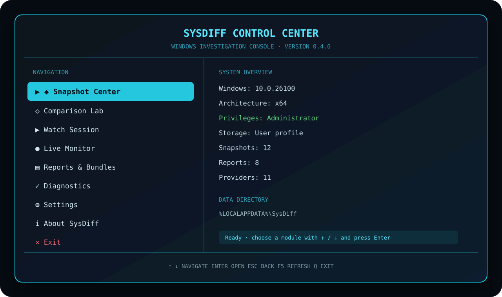

<div align="center">


# SysDiff

**Полноценная терминальная утилита для снимков, сравнения и расследования изменений Windows.**

[](https://github.com/Onmaynec/SysDiff/actions/workflows/build.yml)
[](https://github.com/Onmaynec/SysDiff/actions/workflows/test.yml)
[](https://github.com/Onmaynec/SysDiff/releases)
[](LICENSE)
[](#-системные-требования)

</div>

> [!IMPORTANT]
> **SysDiff не является антивирусом.** Он фиксирует и объясняет системные изменения, но не объявляет объект безопасным или вредоносным.



## 🖥️ Terminal Control Center 0.4.0

Запустите SysDiff без аргументов:

```powershell
sysdiff
```

или из исходников:

```powershell
dotnet run --project .\src\SysDiff.Cli
```

Откроется собственная полноэкранная терминальная панель. Основной интерфейс больше не требует ввода числовых команд: разделы выбираются стрелками, действия открываются клавишей `Enter`, возврат выполняется через `Esc`.

### Управление

| Клавиша | Действие |
|---|---|
| `↑` / `↓` | навигация по меню и спискам |
| `Enter` | открыть выбранный пункт |
| `Esc` | вернуться назад |
| `/` | поиск в Change Explorer |
| `F` | переключить минимальную важность |
| `S` | изменить сортировку |
| `R` | показать или скрыть raw changes |
| `E` | экспортировать сравнение |
| `F5` | обновить dashboard |
| `Q` | выйти из SysDiff |

## ✨ Возможности 0.4.0

- 🖥️ полноэкранный Terminal Control Center;
- 🎨 ASCII-логотип, панели, цветовые статусы и компактная компоновка;
- ⌨️ управление стрелками без мыши;
- ✨ spinner-анимации и прогресс длительных операций;
- 📸 интерактивный Snapshot Center;
- 🔎 Comparison Lab с поиском, severity-фильтром и Change Explorer;
- 👀 пошаговый Watch Session;
- 📡 интерактивный Process/Network Live Monitor;
- 📄 центр отчётов и investigation bundles;
- 🩺 диагностика Windows, прав, SQLite, providers и размера терминала;
- 🔁 автоматическое восстановление курсора и цветов после выхода;
- 🤖 сохранение обычного CLI для PowerShell, CI и автоматизации.

## 🧭 Разделы панели

### Snapshot Center

- создание снимка с выбором профиля;
- анимированный прогресс текущего provider;
- просмотр статуса и числа объектов;
- экспорт и импорт `.sdshot`;
- безопасное удаление с подтверждением.

### Comparison Lab

- выбор `before` и `after` стрелками;
- режимы шума `Balanced`, `Strict`, `Raw`;
- явный cross-machine режим;
- обзор `Added`, `Removed`, `Modified`, `Moved`, `Renamed`;
- просмотр свойств `before → after`;
- HTML, JSON, Markdown и investigation bundle.

### Watch Session

- запуск программы или ручной режим;
- этапы `before → launch/wait → stabilization → after → compare`;
- ожидание дерева дочерних процессов;
- безопасный тайм-аут без принудительного завершения процессов;
- автоматический HTML-отчёт.

### Live Monitor

- события запуска и завершения процессов;
- события появления и исчезновения TCP/UDP endpoints;
- ограничение по времени и root PID;
- JSON/Markdown-журналы;
- содержимое сетевого трафика не читается.

## 🔍 Классический CLI сохранён

Интерактивная панель не заменяет команды автоматизации:

```powershell
sysdiff doctor
sysdiff snapshot create before --profile standard
sysdiff snapshot create after --profile standard
sysdiff compare before after --format html --output .\report.html
sysdiff watch .\Setup.exe --wait-for-children --timeout 900
sysdiff live process --duration 60
sysdiff snapshot export before --output .\before.sdshot
```

При перенаправленном `stdin` или `stdout` TUI не запускается и не добавляет ANSI-последовательности в машинный вывод.

## 🚀 Быстрый старт

### Системные требования

- Windows 10 x64 или Windows 11 x64;
- CMD, Windows PowerShell, PowerShell 7 или Windows Terminal;
- для сборки — .NET 8 SDK;
- права администратора рекомендуются для полного снимка.

### Сборка

```powershell
git clone https://github.com/Onmaynec/SysDiff.git
cd SysDiff

dotnet restore SysDiff.sln
dotnet build SysDiff.sln --configuration Release
dotnet test SysDiff.sln --configuration Release
```

### Portable-пакет

```powershell
.\scripts\package.ps1
```

Результат:

```text
SysDiff-0.4.0-win-x64.zip
SysDiff-0.4.0-win-x64.zip.sha256
```

## 🧩 Источники системных данных

SysDiff анализирует:

- файлы и каталоги;
- реестр;
- службы;
- задачи планировщика;
- автозагрузку;
- переменные окружения и PATH;
- Windows Firewall;
- установленные приложения;
- системные драйверы;
- сертификаты Windows;
- адаптеры, DNS, шлюзы, proxy и маршруты.

Подробнее: [docs/PROVIDERS.md](docs/PROVIDERS.md).

## 🔐 Безопасность и конфиденциальность

- пользовательские пути маскируются как `%USERPROFILE%`;
- приватные ключи сертификатов не читаются;
- плагины загружаются только через явный `--plugin`;
- `.sdshot` проверяет структуру, размер и SHA-256;
- найденные команды, пути и аргументы считаются данными и не выполняются;
- live monitor не изменяет процессы, Firewall, DNS или маршруты;
- SysDiff хранит снимки и отчёты локально.

Подробнее: [docs/SECURITY.md](docs/SECURITY.md) и [docs/PRIVACY.md](docs/PRIVACY.md).

## 📚 Документация

- [Terminal Control Center](docs/TERMINAL_UI.md)
- [Команды](docs/COMMANDS.md)
- [Архитектура](docs/ARCHITECTURE.md)
- [Провайдеры](docs/PROVIDERS.md)
- [Переносимые форматы](docs/PORTABLE_FORMATS.md)
- [Provider SDK](docs/PROVIDER_SDK.md)
- [Решение проблем](docs/TROUBLESHOOTING.md)
- [Roadmap](docs/ROADMAP.md)
- [История изменений](CHANGELOG.md)

## ⚠️ Ограничения

- очень короткоживущие события могут завершиться между интервалами опроса;
- защищённые области требуют администратора;
- большие профили могут содержать сотни тысяч объектов;
- узкие терминалы используют компактную одноколоночную компоновку;
- оценка важности является объяснимой эвристикой, а не антивирусным вердиктом.

## 📜 Лицензия

Проект распространяется по лицензии [MIT](LICENSE).

---

<div align="center">

**SysDiff 0.4.0 — полноценная Windows-утилита внутри терминала.**

</div>
