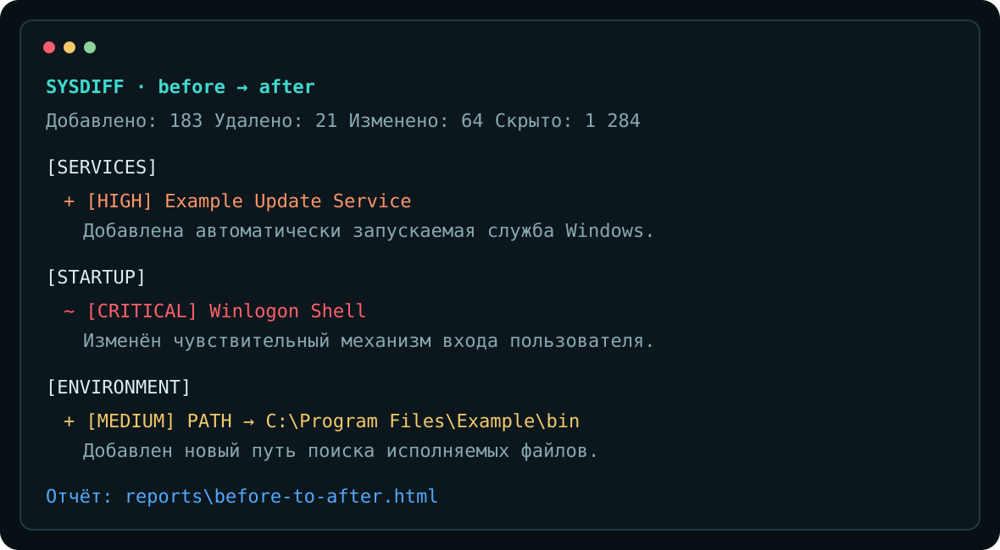

<div align="center">


# SysDiff

**Консольный инструмент для сравнения состояния Windows до и после установки или запуска программы.**

[](https://github.com/Onmaynec/SysDiff/actions/workflows/build.yml)
[](https://github.com/Onmaynec/SysDiff/actions/workflows/test.yml)
[](https://github.com/Onmaynec/SysDiff/releases)
[](LICENSE)
[](#-системные-требования)

</div>

> [!IMPORTANT]
> **SysDiff не является антивирусом.** Он показывает различия между двумя снимками системы и помогает исследовать поведение приложений, но не утверждает, что найденное изменение безопасно или вредоносно.



## 🔍 Что такое SysDiff

SysDiff фиксирует состояние выбранных областей Windows, сохраняет снимки в SQLite и сравнивает их по стабильным идентификаторам. Версия **0.2.0** покрывает файлы, реестр, службы, задачи планировщика, автозагрузку, переменные окружения, Windows Firewall, установленные приложения, системные драйверы и сертификаты.

```powershell
sysdiff snapshot create before --profile standard

# Установите или запустите исследуемую программу

sysdiff snapshot create after --profile standard
sysdiff compare before after
```

Автоматический сценарий с ожиданием дерева процессов:

```powershell
sysdiff watch .\ExampleSetup.exe --arguments "/S" --wait-for-children --timeout 900
```

## ✨ Возможности 0.2.0

- 📸 именованные снимки Windows;
- 🧩 независимые расширяемые провайдеры;
- 🗃️ SQLite-хранилище снимков и сравнений;
- 🔎 определение `Added`, `Removed` и `Modified`;
- 🚦 объяснимые уровни важности от `Info` до `Critical`;
- 🧹 фильтрация шума `Raw`, `Balanced` и `Strict`;
- 🖥️ CLI и базовое интерактивное меню;
- 👀 `watch` с ожиданием дочерних процессов, тайм-аутом и паузой стабилизации;
- 🧱 снимки Firewall, установленных приложений, драйверов и сертификатов;
- 📄 Console, JSON, Markdown и автономные HTML-отчёты;
- 🔐 маскирование чувствительных значений реестра;
- 📦 portable-режим и self-contained ZIP;
- 🧪 unit-тесты, Windows-тесты и smoke-тест CLI;
- ⚙️ GitHub Actions для сборки, тестов и релизов.

### Реализованные провайдеры

| Провайдер | Что собирается | Версия |
|---|---|---|
| `filesystem` | файлы, каталоги, размер, даты, атрибуты, SHA-256 | 0.1 |
| `registry` | HKCU/HKLM/HKCR, Registry32/Registry64, маскирование секретов | 0.1 |
| `services` | службы, состояние, путь, запуск, учётная запись, зависимости | 0.1 |
| `scheduled-tasks` | задачи, действия, триггеры и привилегии | 0.1 |
| `startup` | Run/RunOnce, Startup Folder, Winlogon | 0.1 |
| `environment` | пользовательские и системные переменные, элементы PATH | 0.1 |
| `firewall` | направление, действие, профили, порты, адреса, программа и служба | 0.2 |
| `installed-apps` | uninstall-разделы HKCU/HKLM, области user/machine, x86/x64 | 0.2 |
| `drivers` | системные драйверы, состояния, пути, SHA-256 и сведения о подписи | 0.2 |
| `certificates` | хранилища Windows, сроки, назначения и доверие без экспорта ключей | 0.2 |

Подробнее: [docs/PROVIDERS.md](docs/PROVIDERS.md).

## 🚀 Быстрый старт

### Системные требования

- Windows 10 x64 или Windows 11 x64;
- для сборки — .NET 8 SDK;
- Windows PowerShell 5.1 или PowerShell 7;
- права администратора рекомендуются для полного доступа к системным данным.

### Сборка из исходников

```powershell
git clone https://github.com/Onmaynec/SysDiff.git
cd SysDiff

dotnet restore
dotnet build
dotnet test
dotnet run --project src/SysDiff.Cli -- --help
```

Или одной командой:

```powershell
.\scripts\build.ps1
```

### Portable-пакет

```powershell
.\scripts\package.ps1
```

Результат:

```text
SysDiff-0.2.0-win-x64.zip
SysDiff-0.2.0-win-x64.zip.sha256
```

## 🧭 Основные команды

```powershell
# Диагностика
sysdiff doctor

# Снимки
sysdiff snapshot create before
sysdiff snapshot list
sysdiff snapshot show before
sysdiff snapshot delete before --yes

# Сравнение и отчёты
sysdiff compare before after
sysdiff compare before after --noise Strict --severity Medium
sysdiff compare before after --format html --output .\report.html
sysdiff compare before after --format json --output .\report.json

# Наблюдение
sysdiff watch .\Setup.exe --arguments "/S" --wait-for-children
sysdiff watch .\Setup.exe --wait-for-children --timeout 900
sysdiff watch --no-launch --profile standard

# Профили и пути
sysdiff profile list
sysdiff profile show standard
sysdiff config path
```

Полный справочник: [docs/COMMANDS.md](docs/COMMANDS.md).

## 🎛️ Профили сканирования

| Профиль | Назначение | Провайдеры и особенности |
|---|---|---|
| `minimal` | быстрая проверка | службы, задачи, автозагрузка, окружение, Firewall, приложения |
| `standard` | анализ установщика | все провайдеры, выбранные каталоги и разделы реестра, Smart hashing |
| `full` | глубокое исследование | все провайдеры, расширенные корни, Full hashing, большой объём данных |

Пример собственного профиля: [`samples/profiles/installer-audit.json`](samples/profiles/installer-audit.json).

## 👀 Улучшенный watch

`watch` создаёт начальный снимок, запускает программу, ожидает её завершения и формирует итоговый HTML-отчёт.

- `--wait-for-children` отслеживает обнаруженное дерево потомков через Windows Toolhelp API;
- `--timeout <seconds>` прекращает ожидание и переходит к итоговому снимку;
- процессы при тайм-ауте **не завершаются автоматически**;
- `--stabilization-delay` даёт системе завершить фоновые операции;
- `--noise` выбирает режим фильтрации итогового сравнения.

## 📊 Отчёты

Автономный HTML-отчёт содержит поиск, фильтрацию, сортировку, категории, уровни важности, старые и новые значения, тёмную и светлую тему, адаптивную вёрстку и режим печати. Системные строки экранируются от HTML-инъекций.

Подробнее: [docs/REPORTS.md](docs/REPORTS.md).

## 🔐 Безопасность и конфиденциальность

- найденные пути, аргументы, команды удаления и действия задач считаются только данными;
- PowerShell используется в изолированных read-only JSON-адаптерах;
- приватные ключи сертификатов не читаются и не экспортируются;
- большие файлы драйверов хешируются потоково;
- значения реестра с именами `password`, `token`, `secret`, `credential`, `apikey` и `privatekey` заменяются на `<redacted>`;
- ошибка одного провайдера не останавливает остальные источники.

Перед публикацией отчёта проверьте пути, имена приложений и другие системные данные. Подробнее: [docs/PRIVACY.md](docs/PRIVACY.md) и [docs/SECURITY.md](docs/SECURITY.md).

## ⚠️ Ограничения

- SysDiff сравнивает состояния и не перехватывает каждое событие в реальном времени.
- Объекты, созданные и удалённые между снимками, могут не попасть в отчёт.
- Защищённые области требуют прав администратора.
- Очень короткоживущий дочерний процесс может завершиться между опросами Toolhelp.
- Проверка подписи драйвера в 0.2.0 подтверждает наличие читаемого сертификата, но не заменяет полную проверку доверия Authenticode.
- Проверка цепочки сертификата выполняется локально без сетевой загрузки промежуточных сертификатов.
- Большие профили могут создавать сотни тысяч объектов и занимать значительное место.
- Оценка важности не является вердиктом о вредоносности.

Подробнее: [docs/TROUBLESHOOTING.md](docs/TROUBLESHOOTING.md).

## 🏗️ Архитектура

```text
CLI / интерактивное меню
          │
          ▼
SnapshotCoordinator ── ComparisonEngine
          │                 ├── SeverityEngine
          │                 └── NoiseFilterEngine
          ▼
ISnapshotProvider[]
  ├── FileSystem / Registry / Services / Tasks
  ├── Startup / Environment / Installed Apps
  └── Firewall / Drivers / Certificates
          │
          ▼
      SQLite Store
          │
          ▼
Console / JSON / Markdown / HTML
```

Подробности: [docs/ARCHITECTURE.md](docs/ARCHITECTURE.md).

## 🗺️ Roadmap

- **0.1.0:** ядро снимков, сравнение, основные провайдеры и отчёты — готово;
- **0.2.0:** Firewall, приложения, драйверы, сертификаты и улучшенный `watch` — готово;
- **0.3.0:** live monitor, `.sdshot`, пользовательские профили, investigation bundle и SDK провайдеров;
- **1.0.0:** стабильная схема, подписанные релизы и безопасные rollback handlers.

Подробнее: [docs/ROADMAP.md](docs/ROADMAP.md).

## 🤝 Участие в разработке

Идеи, отчёты об ошибках и pull request приветствуются. Перед изменениями прочитайте [CONTRIBUTING.md](CONTRIBUTING.md) и не прикладывайте необработанные снимки с персональными данными.

## 📜 Лицензия

Проект распространяется по лицензии [MIT](LICENSE).

---

<div align="center">

**SysDiff — узнай, что изменилось в Windows.** 🪟🔎

</div>
