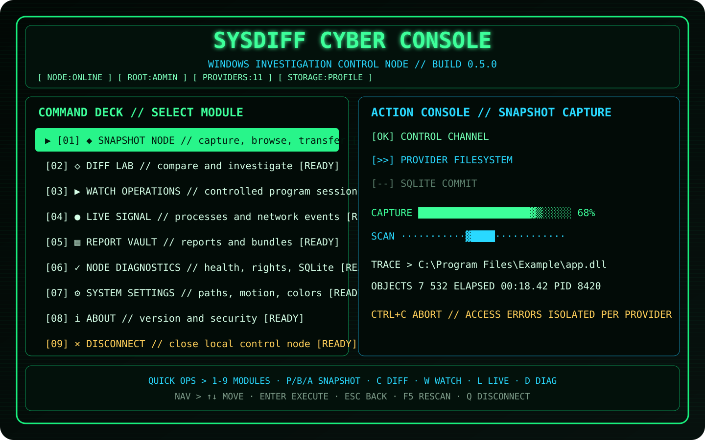

<div align="center">


# SysDiff

**Полноценная cyber-terminal утилита для снимков, сравнения и расследования изменений Windows.**

[](https://github.com/Onmaynec/SysDiff/actions/workflows/build.yml)
[](https://github.com/Onmaynec/SysDiff/actions/workflows/test.yml)
[](https://github.com/Onmaynec/SysDiff/releases)
[](LICENSE)
[](#-системные-требования)

</div>

> [!IMPORTANT]
> **SysDiff не является антивирусом.** Он фиксирует и объясняет системные изменения, но не объявляет объект безопасным или вредоносным.



## 🟢 Cyber Console 0.5.0

Запустите SysDiff без аргументов:

```powershell
sysdiff
```

или из исходников:

```powershell
dotnet run --project .\src\SysDiff.Cli
```

Версия 0.5.0 превращает Terminal Control Center в плотный **Cyber Control Node**, визуально ближе к NexRoute: нумерованные модули, ASCII-логотип, неоновая палитра, boot sequence, Action Console и живой поток providers.

### Command Deck

| Клавиша | Действие |
|---|---|
| `1`…`9` | открыть модуль напрямую |
| `P`, `B`, `A` | Snapshot Node |
| `C` | Diff Lab |
| `W` | Watch Operations |
| `L` | Live Signal Monitor |
| `D` | Diagnostics |
| `↑` / `↓` | перемещение по меню |
| `Enter` | выполнить выбранное действие |
| `Esc` | вернуться назад |
| `F5` | обновить Control Node |
| `Q` | выйти |

В Change Explorer сохранены `/`, `F`, `S`, `R` и `E` для поиска, severity-фильтра, сортировки, raw mode и экспорта.

## ⚡ Анимации действий

### Boot sequence

При интерактивном запуске SysDiff кратко проверяет:

```text
[OK] NEGOTIATING TERMINAL CHANNEL
[OK] VERIFYING LOCAL STORAGE
[>>] INDEXING SNAPSHOT PROVIDERS
[--] ARMING COMPARISON ENGINE
[--] SYNCING LIVE MONITORS
```

Анимацию можно пропустить любой клавишей. Она не выполняет дополнительных системных действий и не изменяет результат работы.

### Action Console

Длительные операции больше не показывают один символ spinner. Отдельная панель отображает:

- этапы `queued`, `running`, `completed`, `failed`, `cancelled`;
- текущую операцию;
- elapsed time и PID;
- progress/scanner bars;
- итоговый статус;
- напоминание о безопасной отмене через `Ctrl+C`.

### Provider Stream

Во время снимка видно активный provider, количество обработанных объектов и текущий путь или системный объект. Ошибка доступа остаётся локальной для provider и не разрушает весь снимок.

## 🎨 Cyber theme

Единая палитра применяется ко всем экранам:

- neon green — активный модуль и успешные этапы;
- cyan — текущий поток и аналитические данные;
- amber — предупреждения и частичные результаты;
- red — ошибки;
- маркеры `[OK]`, `[!!]`, `[XX]`, `[>>]`, `[--]` сохраняют смысл без цвета.

Для совместимости:

```powershell
$env:SYSDIFF_NO_ANIMATIONS = "1"  # отключить движение
$env:NO_COLOR = "1"               # отключить цвета
sysdiff
```

При redirected output и в CI интерактивные анимации отключаются автоматически.

## ✨ Возможности SysDiff

- 📸 снимки файлов, реестра, служб, задач, автозагрузки и окружения;
- 🧱 Firewall, установленные приложения, драйверы и сертификаты;
- 🌐 адаптеры, DNS, шлюзы, proxy и маршруты;
- 🔴 live process monitor;
- 📡 live network endpoint monitor без чтения трафика;
- ↔️ `Moved` и `Renamed` для однозначных файловых изменений;
- 🖥️ cross-machine compare;
- 📦 экспорт и импорт `.sdshot` с SHA-256;
- 🧳 investigation bundle;
- 🎛️ пользовательские JSON-профили;
- 🧩 Provider SDK и явная загрузка plugins;
- 🕶️ маскирование `%USERPROFILE%`;
- 📄 Console, JSON, Markdown и автономные HTML-отчёты;
- 🗃️ SQLite и portable mode.

## 🔍 Классический CLI сохранён

Cyber Console не заменяет автоматизацию:

```powershell
sysdiff doctor
sysdiff snapshot create before --profile standard
sysdiff snapshot create after --profile standard
sysdiff compare before after --format html --output .\report.html
sysdiff watch .\Setup.exe --wait-for-children --timeout 900
sysdiff live process --duration 60
sysdiff snapshot export before --output .\before.sdshot
```

При перенаправленном `stdin` или `stdout` TUI не запускается и не добавляет управляющие последовательности в машинный вывод.

## 🚀 Быстрый старт

### Системные требования

- Windows 10 x64 или Windows 11 x64;
- CMD, Windows PowerShell, PowerShell 7 или Windows Terminal;
- для сборки — .NET 8 SDK;
- права администратора рекомендуются для полного снимка.

### Сборка

```powershell
git clone https://github.com/Onmaynec/SysDiff.git
cd SysDiff

dotnet restore SysDiff.sln
dotnet build SysDiff.sln --configuration Release
dotnet test SysDiff.sln --configuration Release
```

### Portable-пакет

```powershell
.\scripts\package.ps1
```

Результат:

```text
SysDiff-0.5.0-win-x64.zip
SysDiff-0.5.0-win-x64.zip.sha256
```

## 🔐 Безопасность и конфиденциальность

- пользовательские пути маскируются как `%USERPROFILE%`;
- приватные ключи сертификатов не читаются;
- плагины загружаются только через явный `--plugin`;
- `.sdshot` проверяет структуру, размер и SHA-256;
- найденные команды, пути и аргументы считаются данными и не выполняются;
- live monitor не изменяет процессы, Firewall, DNS или маршруты;
- анимации являются только представлением и не запускают дополнительные команды;
- снимки и отчёты хранятся локально.

## 📚 Документация

- [Cyber Console](docs/TERMINAL_UI.md)
- [Команды](docs/COMMANDS.md)
- [Архитектура](docs/ARCHITECTURE.md)
- [Провайдеры](docs/PROVIDERS.md)
- [Переносимые форматы](docs/PORTABLE_FORMATS.md)
- [Provider SDK](docs/PROVIDER_SDK.md)
- [Решение проблем](docs/TROUBLESHOOTING.md)
- [Roadmap](docs/ROADMAP.md)
- [История изменений](CHANGELOG.md)

## ⚠️ Ограничения

- очень короткоживущие события могут завершиться между интервалами опроса;
- защищённые области требуют администратора;
- большие профили могут содержать сотни тысяч объектов;
- узкие терминалы используют compact layout;
- оценка важности является объяснимой эвристикой, а не антивирусным вердиктом.

## 📜 Лицензия

Проект распространяется по лицензии [MIT](LICENSE).

---

<div align="center">

**SysDiff 0.5.0 — Windows investigation utility with a Cyber Control Node.**

</div>
