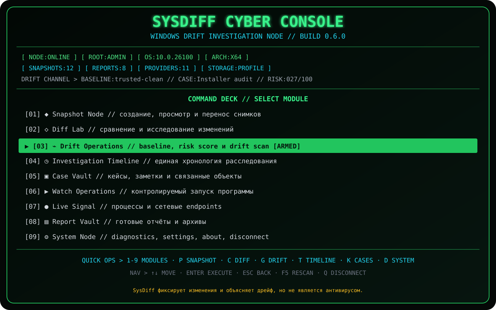

<div align="center">


# SysDiff

**Полноценная cyber-terminal утилита для снимков, сравнения и расследования дрейфа Windows.**

[](https://github.com/Onmaynec/SysDiff/actions/workflows/build.yml)
[](https://github.com/Onmaynec/SysDiff/actions/workflows/test.yml)
[](https://github.com/Onmaynec/SysDiff/releases)
[](LICENSE)
[](#-системные-требования)
[](CHANGELOG.md)

</div>

> [!IMPORTANT]
> **SysDiff не является антивирусом.** Он фиксирует, сравнивает и объясняет системные изменения, но не объявляет объект безопасным или вредоносным.



## 🧭 SysDiff 0.6.0 — Drift Operations

Версия 0.6.0 добавляет постоянную доверенную baseline, быстрый Drift Scan, explainable risk score, Investigation Timeline и локальные Case Vault.

Запуск интерактивной панели:

```powershell
sysdiff
```

Из исходников:

```powershell
dotnet run --project .\src\SysDiff.Cli
```

Cyber Control Node содержит девять модулей:

```text
[01] Snapshot Node
[02] Diff Lab
[03] Drift Operations
[04] Investigation Timeline
[05] Case Vault
[06] Watch Operations
[07] Live Signal
[08] Report Vault
[09] System Node
```

### Command Deck

| Клавиша | Действие |
|---|---|
| `1`…`9` | открыть модуль по номеру |
| `P`, `B`, `A` | Snapshot Node |
| `C` | Diff Lab |
| `G` | Drift Operations |
| `T` | Investigation Timeline |
| `K` | Case Vault |
| `W` | Watch Operations |
| `L` | Live Signal |
| `D` | System Node |
| `↑` / `↓` | перемещение |
| `Enter` | выполнить действие |
| `Esc` | назад |
| `F5` | обновить Control Node |
| `Q` | завершить сессию |

## 🧷 Baseline Vault

Baseline — сохранённый снимок, который пользователь считает доверенным состоянием системы.

CLI:

```powershell
sysdiff baseline set trusted-clean --note "После чистой установки"
sysdiff baseline show
sysdiff baseline clear
```

TUI позволяет выбрать снимок стрелками, просмотреть metadata, заменить или снять baseline. Снятие baseline не удаляет сам snapshot.

Повреждённые, отменённые и failed snapshots нельзя закрепить. Partial snapshot разрешён только с явным предупреждением.

## 📡 Drift Scan

Drift Scan выполняет единый сценарий:

```text
trusted baseline
       ↓
current snapshot
       ↓
comparison + noise filter
       ↓
explainable risk score
       ↓
HTML + JSON + timeline + active case
```

CLI:

```powershell
sysdiff drift scan
sysdiff drift scan --profile minimal --noise Strict
sysdiff drift scan --profile standard --noise Balanced
```

Результат содержит:

- индекс `0–100`;
- уровень `Stable`, `Notice`, `Elevated`, `High` или `Critical`;
- распределение `Info`…`Critical`;
- основные факторы оценки;
- предупреждение о partial providers;
- пути HTML и JSON отчётов.

> [!NOTE]
> Drift Risk Score — детерминированная эвристика важности изменений, а не вероятность заражения.

## 🕒 Investigation Timeline

Timeline объединяет старые и новые данные:

- snapshots;
- comparisons;
- Drift Scans;
- reports;
- cases;
- заметки baseline.

```powershell
sysdiff timeline list
sysdiff timeline list --limit 100
sysdiff timeline list --kind DriftScan
```

Снимки и сравнения, созданные версиями 0.1–0.5, реконструируются в ленте без изменения исходных таблиц.

## 🗂️ Case Vault

Кейс объединяет связанные снимки, сравнения и отчёты локального расследования.

```powershell
sysdiff case create "Installer audit" --description "Проверка Setup.exe" --tags installer,test
sysdiff case list
sysdiff case show "Installer audit"
sysdiff case use "Installer audit"
sysdiff case close "Installer audit"
sysdiff case use none
```

Новый Drift Scan автоматически привязывает snapshot, comparison и HTML report к активному кейсу. Закрытие кейса не удаляет связанные файлы и снимки.

## ⚡ Cyber Console и анимации

Сохраняются возможности 0.5.0:

- boot sequence;
- Action Console;
- Provider Stream;
- progress/scanner bars;
- elapsed time;
- neon green/cyan/amber/red theme;
- маркеры `[OK]`, `[>>]`, `[--]`, `[!!]`, `[XX]`, `[//]`.

Безопасный режим:

```powershell
$env:SYSDIFF_NO_ANIMATIONS = "1"
$env:NO_COLOR = "1"
sysdiff
```

В CI и при redirected output интерактивное движение автоматически отключается.

## ✨ Основные возможности

- снимки файлов, реестра, служб, задач и автозагрузки;
- переменные окружения и PATH;
- Windows Firewall;
- установленные приложения;
- системные драйверы и SHA-256;
- сертификаты Windows без чтения приватных ключей;
- адаптеры, DNS, шлюзы, proxy и маршруты;
- Process и Network Live Monitor;
- ожидание дерева дочерних процессов;
- `Moved` и `Renamed` detection;
- cross-machine compare;
- `.sdshot` с manifest и checksums;
- investigation bundle;
- пользовательские JSON-профили;
- Provider SDK и явная загрузка DLL;
- маскирование `%USERPROFILE%`;
- Console, JSON, Markdown и автономные HTML-отчёты;
- SQLite и portable mode.

## 🔍 Классический CLI сохранён

```powershell
sysdiff doctor
sysdiff snapshot create before --profile standard
sysdiff snapshot create after --profile standard
sysdiff compare before after --format html --output .\report.html
sysdiff watch .\Setup.exe --wait-for-children --timeout 900
sysdiff live process --duration 60
sysdiff snapshot export before --output .\before.sdshot
```

При перенаправленном `stdin` или `stdout` TUI не запускается и не загрязняет машинный вывод управляющими последовательностями.

## 🚀 Сборка

### Системные требования

- Windows 10 x64 или Windows 11 x64;
- CMD, Windows PowerShell, PowerShell 7 или Windows Terminal;
- .NET 8 SDK для сборки;
- права администратора рекомендуются для полного снимка.

```powershell
git clone https://github.com/Onmaynec/SysDiff.git
cd SysDiff

dotnet restore SysDiff.sln
dotnet build SysDiff.sln --configuration Release
dotnet test SysDiff.sln --configuration Release
```

Portable-пакет:

```powershell
.\scripts\package.ps1
```

Результат:

```text
SysDiff-0.6.0-win-x64.zip
SysDiff-0.6.0-win-x64.zip.sha256
```

## 🗃️ Совместимость базы

0.6.0 добавляет только новые таблицы:

```text
app_migrations
investigation_settings
investigation_cases
investigation_links
timeline_events
```

Таблицы `snapshots`, `snapshot_providers`, `artifacts`, `comparisons` и `changes` не меняются. Инициализация idempotent, а старые snapshots остаются доступными.

Это groundwork до стабильной схемы 1.0; политика 1.0 по-прежнему отслеживается отдельными Issues.

## 🔐 Безопасность

- данные хранятся локально;
- notes, tags, paths и captured commands считаются данными и не выполняются;
- baseline не запускает автоматический rollback;
- Drift Scan не изменяет систему;
- Live Monitor не завершает процессы и не читает содержимое трафика;
- плагины загружаются только через явный `--plugin`;
- опасные удаления требуют подтверждения;
- `Ctrl+C` корректно отменяет длительные операции.

## 📚 Документация

- [Drift Operations](docs/DRIFT_OPERATIONS.md)
- [Cyber Console](docs/TERMINAL_UI.md)
- [Команды](docs/COMMANDS.md)
- [Архитектура](docs/ARCHITECTURE.md)
- [Провайдеры](docs/PROVIDERS.md)
- [Переносимые форматы](docs/PORTABLE_FORMATS.md)
- [Provider SDK](docs/PROVIDER_SDK.md)
- [Конфиденциальность](docs/PRIVACY.md)
- [Безопасность](docs/SECURITY.md)
- [Решение проблем](docs/TROUBLESHOOTING.md)
- [Roadmap](docs/ROADMAP.md)
- [История изменений](CHANGELOG.md)

## ⚠️ Ограничения

- очень короткоживущие события могут завершиться между интервалами опроса;
- защищённые области требуют администратора;
- большие профили могут содержать сотни тысяч объектов;
- risk score зависит от полноты providers;
- baseline является выбранной пользователем точкой доверия;
- SysDiff не заменяет EDR, антивирус или ручную экспертизу.

## 📜 Лицензия

Проект распространяется по лицензии [MIT](LICENSE).

---

<div align="center">

**SysDiff 0.6.0 — baseline, drift scan, timeline и case-based investigations.**

</div>
